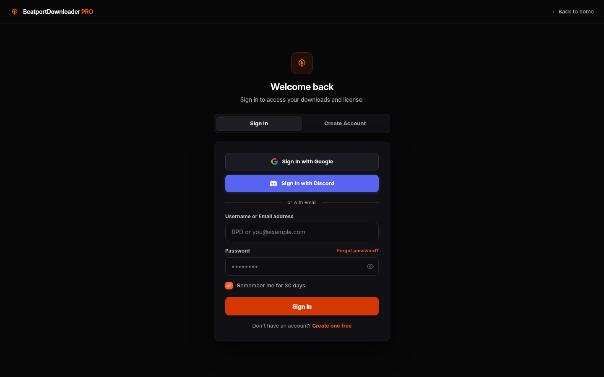
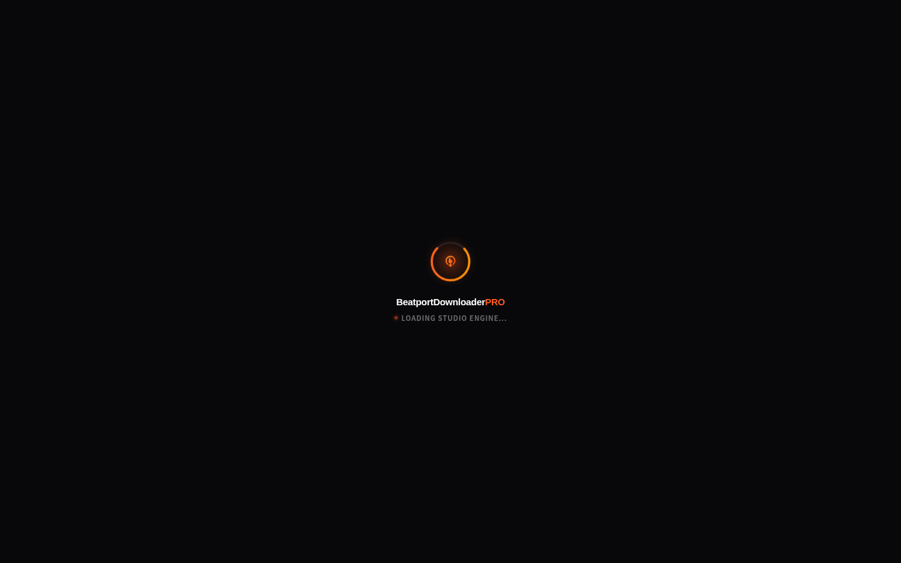
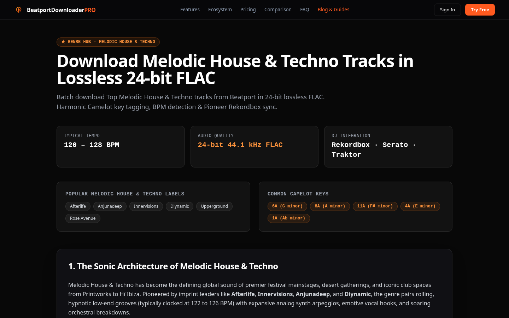
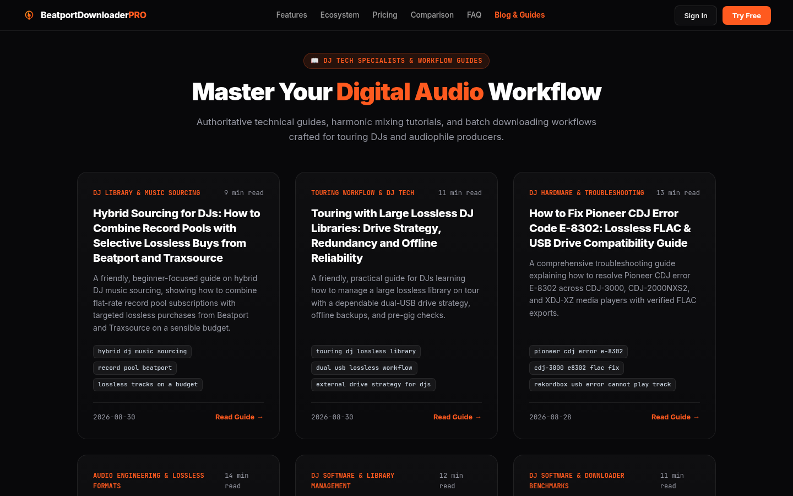

# 🎧 Beatport Downloader PRO
### Free High-Speed Batch Music Downloader for DJs, Producers & Audiophiles
**Download Tracks, Releases & Top 100 Charts in 24-Bit FLAC, 16-Bit WAV, and 320kbps MP3**

[**🌐 Open Web App (Free Demo)**](https://beatport-downloader.com/app) • [**⚡ Official Website**](https://beatport-downloader.com/) • [**📖 DJ Guides & Knowledge Base**](https://beatport-downloader.com/blog) • [**🎁 Redeem Promo Voucher**](https://beatport-downloader.com/app)

---

  

---

## ⚡ Free In-Browser Workstation (Zero Software Install)

**Beatport Downloader PRO** is an interactive batch downloading and DJ library prep workstation. Built for touring headliners, club residents, mobile DJs, and electronic music producers, it enables instant searching, previewing, and batch downloading of tracks, Top 100 charts, and full playlists with automatic **Camelot musical key tagging**, exact **BPM detection**, and **1400×1400 HD album artwork**.

Start using the workstation immediately in your browser with **zero installation required** — powered by in-browser Web Workers or accelerated by standalone desktop background workers on Windows, macOS, and Linux.

👉 **[Launch Free Web App](https://beatport-downloader.com/app)**

---

## 🎁 Free Downloading Features & Daily Quota

Enjoy free high-quality music downloads every day:

* **✨ 100% Free Demo Access**: **50 free downloads every 24 hours** in 128 kbps AAC + **5 free 24-bit Studio Master FLAC downloads** every 24 hours. Zero credit card required.
* **🎁 Promo Code & Bonus Voucher System**: Enter promotional partner codes (such as `100ULTRA`, `100FREEHQ`, or `WELCOME50`) in the web app or settings to unlock additional bonus 24-bit FLAC and high-speed HQ downloads.
* **⚡ Instant Local File Storage**: Automatically saves downloaded tracks directly into your local music folder (`~/Music/Beatport` or custom directory) using the modern File System Access API without browser popup spam.
* **🎧 Full DJ Metadata Tagging**: All free downloads include Camelot harmonic keys, BPM, artist, title, genre, and embedded artwork for Rekordbox and Serato.

---

## 📸 Real Application Screenshots

### 1. In-Browser DJ Workstation & Top 100 Charts
Streamlined catalog discovery, high-precision waveform audio scrubbing, and 1-click batch cart queues.

  

### 2. High-Converting Web Architecture
Universal web workstation running on Windows, macOS, Linux, and modern web browsers.

  

### 3. Electronic Music Genre Hubs (Melodic Techno, Tech House, DnB & More)
Explore and batch download the latest chart-topping tracks across all major electronic sub-genres.

  

### 4. DJ Technical Knowledge Base & Audio Guides
Comprehensive tutorials on harmonic mixing, USB drive preparation for Pioneer CDJs, 24-bit audio analysis, and stem separation.

  

---

## 🌟 Core Technical Capabilities

### 💎 Studio Master 24-Bit FLAC & WAV Lossless
* Download bit-perfect **24-bit / 44.1 kHz FLAC, WAV, and AIFF** files ready for premier festival sound systems and Pioneer CDJ-3000 setups.
* Also supports lightweight **256 kbps & 320 kbps AAC / M4A** for mobile gigs, practice crates, and backup USBs.

### 🎧 Automatic Camelot Key & BPM Tagging
* Standardized ID3v2 metadata writes **Camelot keys (e.g. 8A, 11B)** and precise **BPM** directly into audio tags.
* Instant drag-and-drop compatibility with **Pioneer Rekordbox**, **Serato DJ Pro**, **Traktor Pro 4**, and **Denon Engine DJ**.

### 📦 1-Click Batch Carts, Releases & Playlists
* Queue entire Top 100 genre charts, label discographies, artist releases, or public playlists in a single click.
* Direct multi-threaded concurrent downloading saturates your available network bandwidth.

### 📁 Direct Local Storage (Zero Cloud Middleware)
* Files download directly into your local music folder (`~/Music/Beatport` or custom directory) without browser download bar prompts or popup spam.

---

## 🚀 Quick Start Guide

### Step 1: Open the Free Web App
Navigate to [https://beatport-downloader.com/app](https://beatport-downloader.com/app) in Google Chrome, Brave, Edge, or Firefox.

### Step 2: Choose Your Local Music Folder
Click **Select Folder** to choose your local music destination (e.g., `~/Music/DJ Crates`).

### Step 3: Search or Paste URLs
Paste any Beatport track, release, Top 100 chart, or playlist URL into the search bar.

### Step 4: Batch Download
Click **Download** or queue multiple releases for simultaneous concurrent downloading.

---

## 💻 Standalone Desktop Worker (Optional)

For high-speed background acceleration with bundled FFmpeg, download standalone executables:

* **Windows**: [Download BeatportWorker.exe](https://beatport-downloader.com/downloads/BeatportWorker.exe)
* **macOS**: [Download BeatportWorker-macOS.dmg](https://beatport-downloader.com/downloads/BeatportWorker-macOS.dmg)
* **Linux**: [Download BeatportWorker-Linux.AppImage](https://beatport-downloader.com/downloads/BeatportWorker-Linux.AppImage)

Pair with a 6-digit code in the web app under **Settings -> Worker**.

---

## 🏷️ Frequently Asked Questions (FAQ)

<b>Can I download Beatport tracks for free?</b>

Yes! The Free Demo tier gives you 50 free downloads every 24 hours in 128 kbps AAC plus 5 free Studio Master 24-bit FLAC downloads every 24 hours. You can also redeem partner promo codes to gain additional bonus downloads.

<b>How does Camelot harmonic key tagging work?</b>

Every downloaded track is analyzed on download, and its Camelot key notation (e.g. 6A, 11B) and exact BPM are written directly into standard ID3 tags. When you import tracks into Rekordbox, Serato, Traktor, or Engine DJ, the harmonic key is immediately recognized.

<b>Are these real 24-bit lossless files or upscaled MP3s?</b>

All lossless downloads are bit-perfect Studio Master 24-bit 44.1 kHz FLAC and WAV files sourced directly from lossless master streams with full frequency spectrum extending past 20 kHz.

---

## ⚖️ Disclaimer

Beatport Downloader PRO is an independent utility created for DJs, electronic music producers, and audio enthusiasts. It is not affiliated with, endorsed by, or sponsored by Beatport LLC. Please support artists and record labels by purchasing official music releases and attending live performances.

---

  Built with ❤️ for the global DJ and electronic music community. 
  <a href="https://beatport-downloader.com/"><b>beatport-downloader.com</b></a>

