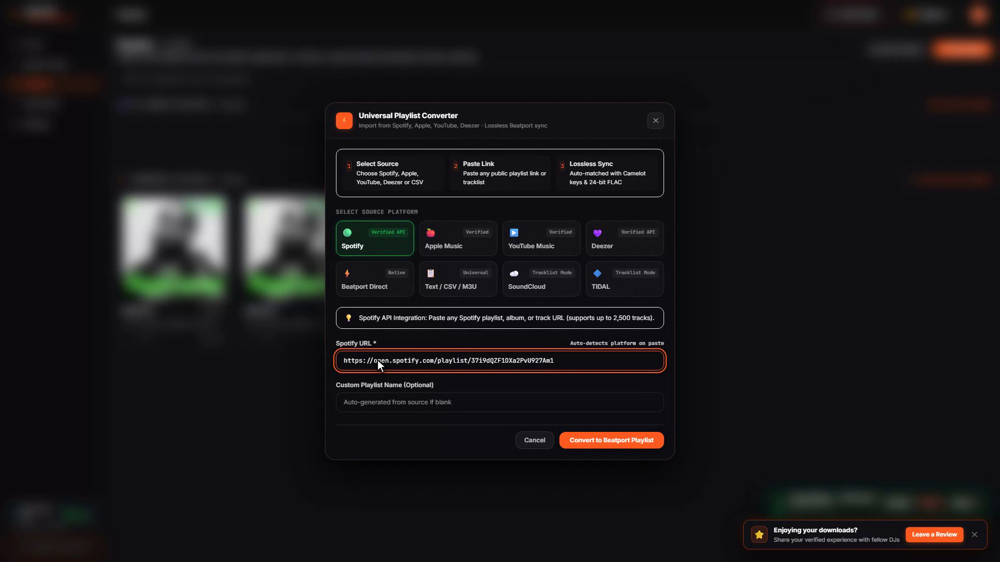

<div align="center">
  <a href="https://beatport-downloader.com/app">
    
  </a>
  <h1 align="center">Beatport Downloader PRO Web Application</h1>
  <p align="center"><strong>Free In-Browser Lossless Music Downloader & Batch Curation Suite for DJs</strong></p>
  <p align="center"><em>Download Studio Master 24-bit FLAC / WAV & High-Quality Audio Directly in Your Browser · 100% Free Daily Tier</em></p>

  <p align="center">
    <a href="https://beatport-downloader.com/app"></a>
    <a href="https://beatport-downloader.com"></a>
    <a href="https://discord.gg/v6K34tQf"></a>
  </p>

  <p align="center">
    
    
    
  </p>

  <br />
  
</div>

---

## ⚡ The Web Application (`beatport-downloader.com/app`)

**Beatport Downloader PRO** is a zero-install, in-browser DJ preparation workstation and batch music downloader. Running directly in Google Chrome, Brave, Microsoft Edge, and Firefox, it turns your browser into a full-featured electronic music discovery and library curation suite.

👉 **[Launch Live Web Application](https://beatport-downloader.com/app)**

---

## 📸 Core Web App Features & Workstation Tour

### 1. 🔍 Live Track Search & Audio Waveform Preview
Search by artist, track title, record label, or catalog number. Audition tracks with instantaneous, high-precision waveform audio scrubbing, and view real-time **Camelot musical key tags (e.g. 8A, 11B)** and **exact BPM** directly in the search grid.
<div align="center">
  
</div>

---

### 2. 🔄 Universal Playlist Converter (Spotify & Apple Music Ingestion)
Paste public playlist URLs from **Spotify**, **Apple Music**, or **Deezer**. The engine automatically matches streaming track metadata against verified Beatport catalog masters and loads extended DJ club mixes into your active download crate.
<div align="center">
  
</div>

---

### 3. 📋 Playlists Hub & DJ Crates Management
Organize converted Spotify crates, Beatport Top 100 charts, and custom DJ playlists. Inspect full tracklists with high-res artwork, Camelot keys, and BPM, and initiate 1-click **Download All in FLAC** batch runs.
<div align="center">
  
</div>

---

### 4. ⬇️ Multi-Threaded Batch Queue & Downloads Manager
Monitor live download progress, transfer speeds, and active file generation. The built-in worker engine concurrency downloads multiple tracks simultaneously and writes them directly into your local destination folder.
<div align="center">
  
</div>

---

### 5. ⚙️ Audio Preferences & Destination Folder Settings
Configure default download containers (**Studio Master 24-bit FLAC**, **16-bit WAV**, or **lightweight 256/320kbps AAC**), select your local music directory with the modern File System Access API, or pair a local background desktop worker for hardware acceleration.
<div align="center">
  
</div>

---

## 🎁 100% Free Daily Downloading Tier

* **✨ Daily Free Quota**: **50 free downloads every 24 hours** in 128 kbps AAC + **5 free Studio Master 24-bit FLAC downloads** every 24 hours. Zero credit card or subscription required.
* **🎧 Full Pro Metadata Injection**: All free downloads include Camelot harmonic keys, BPM, artist, title, genre, and embedded 1400×1400 HD artwork for Pioneer Rekordbox, Serato DJ Pro, Traktor Pro, and Engine DJ.
* **📁 Direct Local Folder Writes**: Saves directly to your hard drive (`~/Music/DJ Crates` or custom folder) without browser download bar spam.

---

## 🚀 How to Use the Web App

```
Workstation Workflow:
┌──────────────────────────────────────────────────────────┐
│ 1. Open https://beatport-downloader.com/app              │
└────────────────────────────┬─────────────────────────────┘
                             │
                             ▼
┌──────────────────────────────────────────────────────────┐
│ 2. Select Local Download Folder (File System Access)     │
└────────────────────────────┬─────────────────────────────┘
                             │
                             ▼
┌──────────────────────────────────────────────────────────┐
│ 3. Search Tracks or Paste Beatport / Spotify Playlists   │
└────────────────────────────┬─────────────────────────────┘
                             │
                             ▼
┌──────────────────────────────────────────────────────────┐
│ 4. Click Download / Batch Queue -> Direct Lossless FLAC  │
└──────────────────────────────────────────────────────────┘
```

---

## 🏷️ Frequently Asked Questions (FAQ)

* **Is there a free tier for daily downloading and DJ preparation?**  
  Yes! Every registered user receives 50 free downloads/24h and 5 free Studio Master 24-bit FLAC downloads daily.
* **Are downloaded tracks compatible with Pioneer CDJs & Rekordbox?**  
  Yes, all downloads feature standardized ID3v2 tags with Camelot keys, exact BPM, and artwork formatted for Pioneer Rekordbox, Serato DJ Pro, Traktor Pro, and Denon Engine DJ.
* **Do I need to install any browser extensions or plugins?**  
  No. The app utilizes standard Web Audio API and File System Access API natively supported in Chrome, Edge, Brave, Opera, and Firefox.

---

<div align="center">
  <p>Official Website: <a href="https://beatport-downloader.com">beatport-downloader.com</a></p>
  <p><em>Built with precision for electronic music selectors and studio professionals worldwide.</em></p>
</div>
