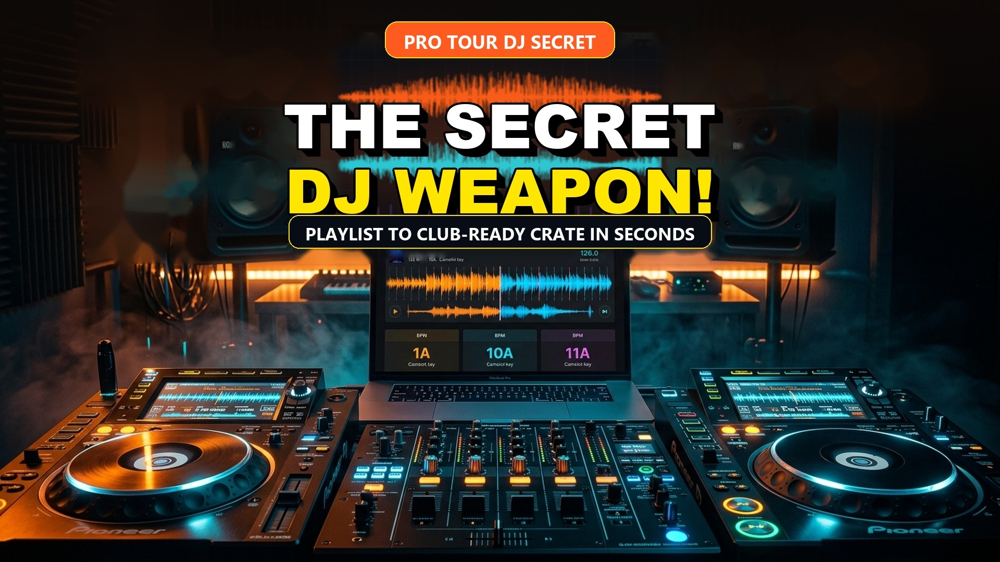
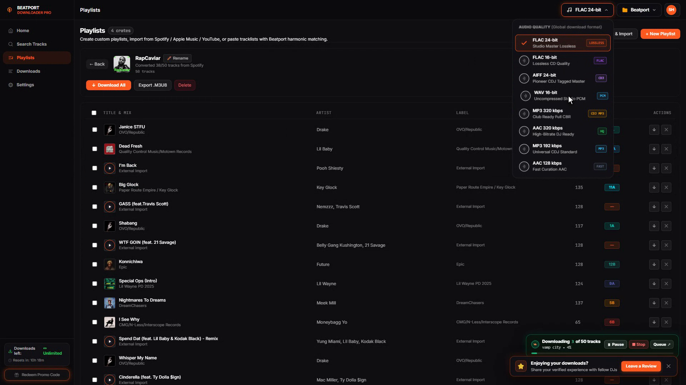

<div align="center">
  <a href="https://beatport-downloader.com/app">
    
  </a>
  <h1 align="center">🎧 Beatport Downloader PRO</h1>
  <p align="center"><strong>The Ultimate Studio-Grade Music Downloader & Curation Suite for Professional DJs and Electronic Music Producers</strong></p>
  <p align="center"><em>Download 24-bit Lossless FLAC, WAV, AIFF & 320 kbps MP3 with Pioneer CDJ / Rekordbox ID3v2.3 Ready Metadata</em></p>

  <p align="center">
    <a href="https://beatport-downloader.com/app"></a>
    <a href="https://beatport-downloader.com"></a>
    <a href="https://discord.gg/v6K34tQf"></a>
  </p>

  <p align="center">
    
    
    
    
  </p>

  <br />
  <a href="https://beatport-downloader.com/app">
    
  </a>
</div>

---

## ⚡ What is Beatport Downloader PRO?

**Beatport Downloader PRO** is the next-generation music acquisition, conversion, and crate-management suite engineered specifically for touring DJs, festival headliners, and club residents. Built from the ground up for maximum sonic fidelity, blazing batch speed, and turnkey Pioneer CDJ / Rekordbox compatibility, it eliminates tedious manual tagging, mismatched waveforms, and low-quality rips forever.

Whether you need **Studio Master 24-bit FLAC / WAV / AIFF**, **320 kbps Club CBR MP3** with CDJ-compatible ID3v2.3 tags, or lightweight AAC curation streams, Beatport Downloader PRO delivers pristine studio audio with 100% verified Camelot keys, exact BPM grids, and high-resolution embedded album artwork out-of-the-box.

👉 **[Launch Live Web Application (No Install Required)](https://beatport-downloader.com/app)**

---

## 🎛️ The 7-Stage Complete DJ Workflow

```
[1. Universal Import] ➔ [2. Harmonic Sync] ➔ [3. Studio Engine] ➔ [4. Batch Queue] ➔ [5. Direct Save] ➔ [6. CDJ Export] ➔ [7. Club Ready]
   Spotify / Apple        BPM & Camelot Keys     24-bit Lossless FLAC      3.4 MB/s Stream       Folder / USB Write      ID3v2.3 & 1400px       Peak Sound Systems
```

| Stage | Feature | Description |
|---|---|---|
| **1. Universal Ingestion** | **Multi-Source Converter** | Paste playlists from Spotify, Apple Music, YouTube Music, Deezer, TIDAL, SoundCloud, or text tracklists. |
| **2. Harmonic Matching** | **Camelot Key Sync** | Instant harmonic detection matching catalog tracks with precise Camelot keys (`1A`–`12B`) and exact BPM. |
| **3. Studio Codec Engine** | **Audiophile Master** | Choose between 24-bit Studio Master FLAC, uncompressed 16-bit WAV PCM, Pioneer AIFF, or 320k MP3. |
| **4. Multi-Stream Queue** | **High-Speed Acceleration** | Download entire 50+ track crates concurrently with multi-threaded chunk streaming up to 3.4 MB/s. |
| **5. Storage Management** | **Direct Disk Auto-Save** | Writes straight to your external USB or DJ directory via Web File System API, or packages into clean ZIPs. |
| **6. DJ Metadata Injection** | **Rekordbox & CDJ Ready** | ID3v2.3 bit-perfect tagging with embedded 1400×1400 front artwork, artist, title, mix, label, key, and BPM. |
| **7. Club Verification** | **Zero Artifacts** | Full dynamic range without clipping, harsh high-frequency cutoff, or missing metadata on CDJ-3000s. |

---

## ✨ Key Features & Benefits

- 💎 **True Studio-Grade Audio Options**: Download in uncompressed **24-bit / 44.1 kHz FLAC**, **24-bit AIFF**, **16-bit WAV (PCM)**, or **320 kbps CBR MP3** encoded with `libmp3lame` and high-frequency cutoff protection.
- 🎛️ **Pioneer CDJ & Rekordbox Ready**: Automatic ID3v2.3 tagging, Camelot harmonic key detection (e.g. `8A / 11B`), exact BPM labeling, and embedded 1400×1400 HD front artwork ensure instant USB plug-and-play on CDJ-3000, CDJ-2000NXS2, and standalone DJ rigs.
- 🔄 **Universal Playlist Ingestion**: Simply paste playlist URLs from Spotify, Apple Music, YouTube Music, Deezer, or TIDAL to automatically resolve and pull official extended DJ club masters directly into your download crate.
- ⚡ **Turbo Batch & Crate Downloads**: One-click acquisition of entire top 100 genre charts, curated DJ sets, and full artist discographies with concurrent multi-threaded worker pipelines.
- 🏷️ **Smart Customizable Naming Templates**: Organize your DJ library automatically with dynamic templates such as `[Key - BPM] Artist - Title (Mix)` or `Artist - Title [Key - BPM]`.
- 🎵 **Integrated DJ Deck & Waveform Player**: Audition tracks with smooth real-time waveform scrubbing, high-precision key meters, and instant in-app preview before queuing.
- 📁 **Direct Local Folder Writes**: Saves directly to your designated external USB or music directory (`~/Music/DJ Crates`) via the modern Web File System Access API.

---

## 🚀 Plan Tiers & Formats

| Plan Tier | Price | Daily Downloads | Audio Formats | Target Use Case |
|---|---|---|---|---|
| **Free Demo** | **€0.00** | **50 total / 24h**<br>*(10 Free 24-bit Lossless)* | `192 kbps MP3` · `128 kbps AAC`<br>• *10 Free 24-bit FLAC / WAV daily* | Everyday Track Curation & Casual Listening |
| **High Quality (PRO)** | **€7.99** | **1,250 total / 24h**<br>*(25 Daily 24-bit Lossless)* | `320 kbps MP3` (CBR CDJ Master)<br>`320 kbps AAC` · `256k AAC` · `192k MP3`<br>• *25 Daily 24-bit FLAC / WAV* | Club DJs & Mobile Gig Performance |
| **Ultra Studio PRO** | **€13.99** | **Unlimited**<br>*(Zero Limits)* | `24-bit FLAC` · `24-bit WAV` · `24-bit AIFF`<br>`320 kbps MP3` · `320 kbps AAC` | Touring Headliners & Studio Mastering |

---

## 📸 Workstation Tour

<div align="center">
  <h3>🏠 Workstation Home & Curated Releases</h3>
  <p><em>Instant access to Top 10 Worldwide, Best New Releases, and global audio quality selectors</em></p>
  

  <h3>🔄 Universal Playlist Converter (Spotify, Apple Music, YouTube, Deezer, TIDAL)</h3>
  <p><em>Convert external playlists into Beatport extended club tracks with harmonic matching</em></p>
  

  <h3>🎛️ Harmonic Sync DJ Crate & Camelot Key Grid</h3>
  <p><em>Automated BPM matching, Camelot key coloring, and 1-Click "Download All" crate batching</em></p>
  

  <h3>🎧 Studio Master Audio Engine (24-Bit FLAC, WAV, AIFF, 320k MP3)</h3>
  <p><em>Choose between all 8 industry-standard studio master codecs and bit depths</em></p>
  

  <h3>⚡ High-Speed Multi-Stream Concurrent Download Engine (3.4 MB/s)</h3>
  <p><em>Stream dozens of lossless files concurrently directly to your storage disk with real-time telemetry</em></p>
  

  <h3>📁 Direct Local USB & DJ Library Directory Auto-Save</h3>
  <p><em>Automatic directory writes with zero browser confirmation prompts</em></p>
  
</div>

---

## 🛠️ Quick Start

### 🌐 Option 1: In-Browser Web App (Recommended)
1. Open **[beatport-downloader.com/app](https://beatport-downloader.com/app)** in Chrome, Brave, Edge, or Firefox.
2. Sign in or create a free account to instantly unlock your **50 daily free downloads + 10 lossless FLAC tracks**.
3. Choose your preferred format from the header **Quick Access Menu** (`FLAC`, `WAV`, `AIFF`, `320k MP3`, etc.).
4. Search or paste a playlist and click **Download**.

### 💻 Option 2: Command-Line Interface (CLI)
```bash
# Clone the repository
git clone https://github.com/b0rut/beatport-downloader.git
cd beatport-downloader

# Install Python dependencies
pip install -r requirements.txt

# Launch interactive CLI suite
python -m beatport_cli --help
```

---

## 🎯 Ideal For

- 🎧 **Club & Festival DJs**: Prepare bulletproof USB drives with harmonic Camelot keys and lossless audio for peak-time mainstage sound systems.
- 📻 **Radio & Podcast Hosts**: Download complete high-bitrate crates in seconds for weekly radio mixes.
- 🎚️ **Producers & Remixer Teams**: Access clean reference tracks and high-definition stems in uncompressed 24-bit quality.

---

## 🌟 Support & Community

- 🌐 **Official Website**: [https://beatport-downloader.com](https://beatport-downloader.com)
- 🚀 **Live Web App**: [https://beatport-downloader.com/app](https://beatport-downloader.com/app)
- 📖 **DJ Guides & Tutorials**: [https://beatport-downloader.com/blog](https://beatport-downloader.com/blog)
- 💬 **Discord VIP Community**: [Join our Discord](https://discord.gg/v6K34tQf)
- ⭐ **Star this repository** if Beatport Downloader PRO powers your DJ sets!

---

<div align="center">
  <sub>Built with ❤️ for the global electronic music community. Pioneer DJ, Rekordbox, and Beatport are trademarks of their respective owners.</sub>
</div>
