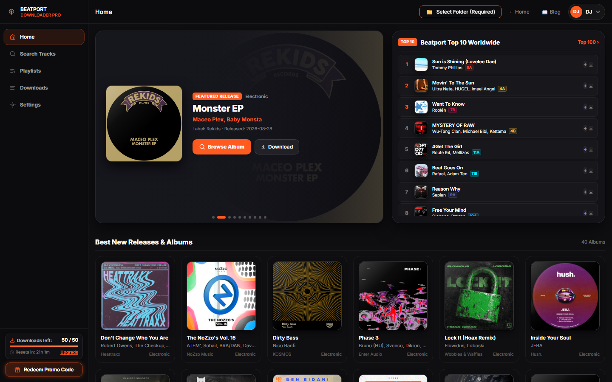
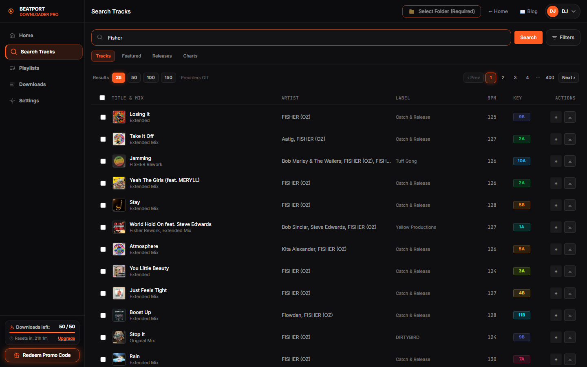
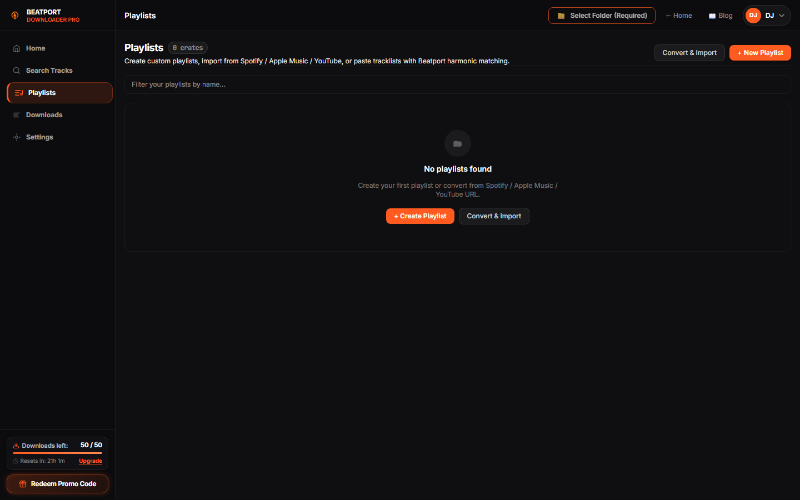
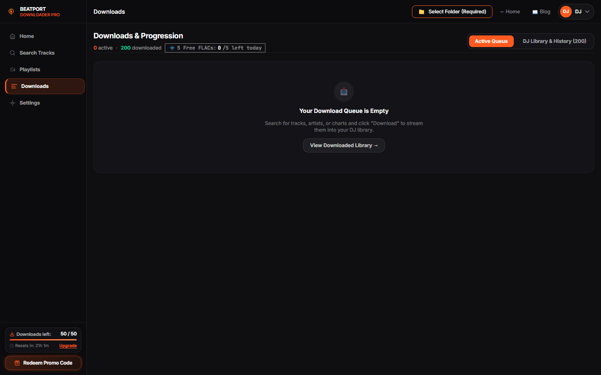
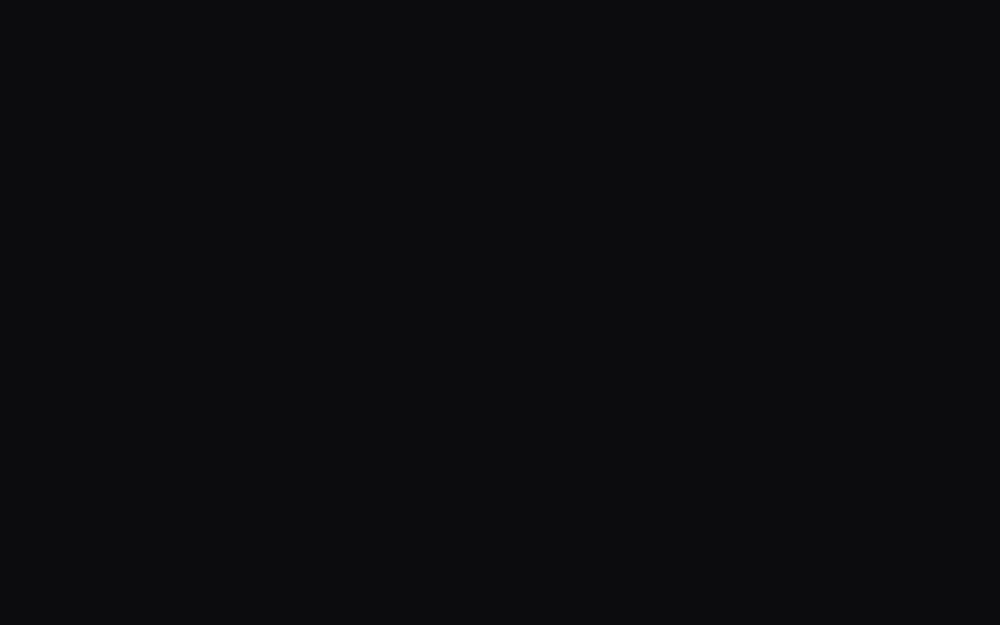
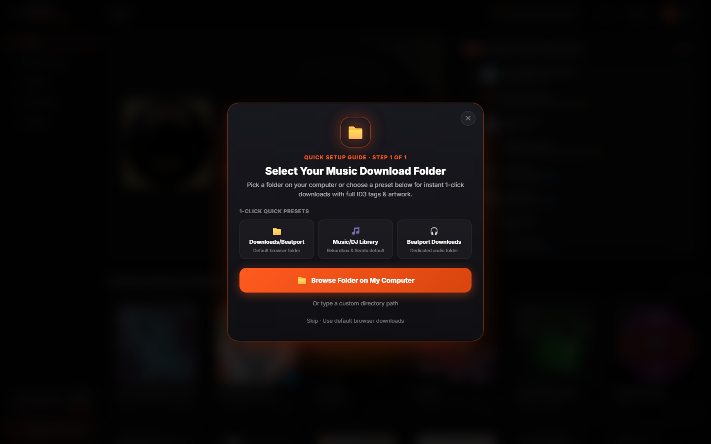

<div align="center">

# 🎧 Beatport Downloader PRO Web Application
### In-Browser DJ Workstation, Batch Downloader & Crate Prep Engine
**Search, Preview, Convert Playlists & Batch Download in 24-Bit FLAC, 16-Bit WAV & 320kbps MP3**

[](https://beatport-downloader.com/app)
[](https://beatport-downloader.com/app)
[](https://beatport-downloader.com/app)
[](https://beatport-downloader.com/app)

[**⚡ Launch Web App (Zero Install)**](https://beatport-downloader.com/app) • [**📖 DJ Guides & Knowledge Base**](https://beatport-downloader.com/blog) • [**🎁 Redeem Promo Voucher**](https://beatport-downloader.com/app)

---

</div>

<div align="center">
  
</div>

---

## ⚡ The Web Application (`beatport-downloader.com/app`)

**Beatport Downloader PRO** is a zero-install, in-browser DJ preparation workstation and batch music downloader. Running directly in Google Chrome, Brave, Microsoft Edge, and Firefox, it turns your browser into a full-featured electronic music discovery and library curation suite.

👉 **[Launch Live Web Application](https://beatport-downloader.com/app)**

---

## 📸 Core Web App Features & Workstation Tour

### 1. 🔍 Live Track Search & Audio Waveform Preview
Search by artist, track title, record label, or catalog number. Audition tracks with instantaneous, high-precision waveform audio scrubbing, and view real-time **Camelot musical key tags (e.g. 8A, 11B)** and **exact BPM** directly in the search grid.
<div align="center">
  
</div>

---

### 2. 📋 Playlist Ingestion & Universal Playlist Converter
Import complete Beatport charts, artist discographies, and user playlists. Use the **Universal Playlist Converter** to paste Spotify, Apple Music, or Deezer playlist links and automatically match and batch download verified extended DJ club mixes.
<div align="center">
  
</div>

---

### 3. ⬇️ Multi-Threaded Batch Queue & Downloads Manager
Monitor live download progress, transfer speeds, and active file generation. The built-in worker engine concurrency downloads multiple tracks simultaneously and writes them directly into your local destination folder.
<div align="center">
  
</div>

---

### 4. ⚙️ Audio Preferences & Destination Folder Settings
Configure default download containers (**Studio Master 24-bit FLAC**, **16-bit WAV**, or **lightweight 256/320kbps AAC**), select your local music directory with the modern File System Access API, or pair a local background desktop worker for hardware acceleration.
<div align="center">
  
</div>

---

### 5. 🎁 Voucher Key & Promo Code Redemption
Unlock extra bonus FLAC and high-speed downloads by entering partner and promotional codes (such as `100ULTRA`, `100FREEHQ`, or `WELCOME50`) in the dedicated promo modal.
<div align="center">
  
</div>

---

## 🎁 100% Free Daily Downloading Tier

* **✨ Daily Free Quota**: **50 free downloads every 24 hours** in 128 kbps AAC + **5 free Studio Master 24-bit FLAC downloads** every 24 hours. Zero credit card or subscription required.
* **🎧 Full Pro Metadata Injection**: All free downloads include Camelot harmonic keys, BPM, artist, title, genre, and embedded 1400×1400 HD artwork for Pioneer Rekordbox, Serato DJ Pro, Traktor Pro, and Engine DJ.
* **📁 Direct Local Folder Writes**: Saves directly to your hard drive (`~/Music/DJ Crates` or custom folder) without browser download bar spam.

---

## 🚀 How to Use the Web App

```
Workstation Workflow:
┌──────────────────────────────────────────────────────────┐
│ 1. Open https://beatport-downloader.com/app              │
└────────────────────────────┬─────────────────────────────┘
                             │
                             ▼
┌──────────────────────────────────────────────────────────┐
│ 2. Select Local Download Folder (File System Access)     │
└────────────────────────────┬─────────────────────────────┘
                             │
                             ▼
┌──────────────────────────────────────────────────────────┐
│ 3. Search Tracks or Paste Beatport / Spotify Playlists   │
└────────────────────────────┬─────────────────────────────┘
                             │
                             ▼
┌──────────────────────────────────────────────────────────┐
│ 4. Click Download / Batch Queue -> Direct Lossless FLAC  │
└──────────────────────────────────────────────────────────┘
```

---

## 💻 Standalone Background Desktop Worker (Optional)

Accelerate queue concurrency with native background workers bundled with FFmpeg:
* **Windows**: [Download BeatportWorker.exe](https://beatport-downloader.com/downloads/BeatportWorker.exe)
* **macOS**: [Download BeatportWorker-macOS.dmg](https://beatport-downloader.com/downloads/BeatportWorker-macOS.dmg)
* **Linux**: [Download BeatportWorker-Linux.AppImage](https://beatport-downloader.com/downloads/BeatportWorker-Linux.AppImage)

Pair in seconds under **Settings -> Worker** inside the web app.

---

## 🏷️ Frequently Asked Questions (FAQ)

<details>
<summary><b>Can I download tracks for free directly in my browser?</b></summary>
Yes! The Web App runs entirely inside your browser. The Free Demo tier gives you 50 free downloads every 24 hours plus 5 free Studio Master 24-bit FLAC downloads every 24 hours.
</details>

<details>
<summary><b>How does Rekordbox Camelot key tagging work?</b></summary>
Every downloaded track is analyzed in real time and its Camelot key notation (e.g. 8A, 11B) and exact BPM are written directly into standard ID3 tags. When you import tracks into Rekordbox, Serato, or Traktor, the harmonic key is immediately recognized.
</details>

<details>
<summary><b>Can I convert Spotify or Apple Music playlists to Beatport?</b></summary>
Yes! Go to the Playlists tab in the web app, paste your playlist URL, and the Universal Converter will resolve all tracks into verified Beatport releases ready for batch downloading.
</details>

---

## ⚖️ Disclaimer

Beatport Downloader PRO is an independent audio workstation for DJs and electronic music producers. It is not affiliated with or endorsed by Beatport LLC. Please support artists and record labels by purchasing official releases and attending live performances.

---

<div align="center">
  <sub>Built with ❤️ for the global electronic music & DJ community.</sub><br />
  <a href="https://beatport-downloader.com/app"><b>beatport-downloader.com/app</b></a>
</div>
